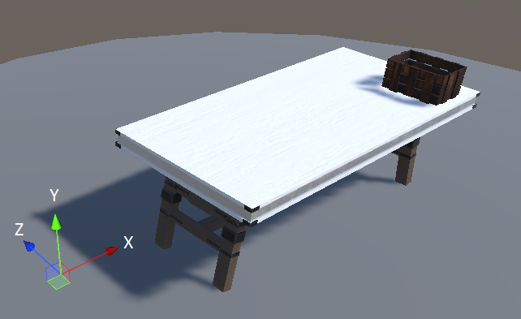
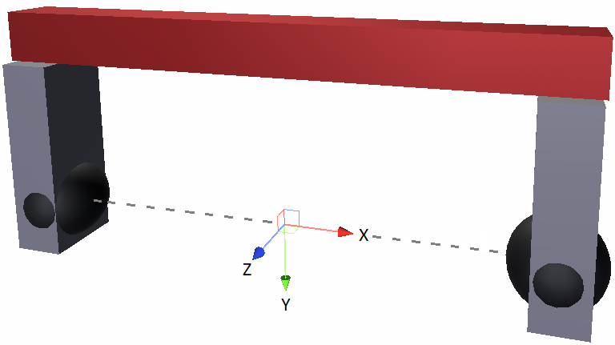
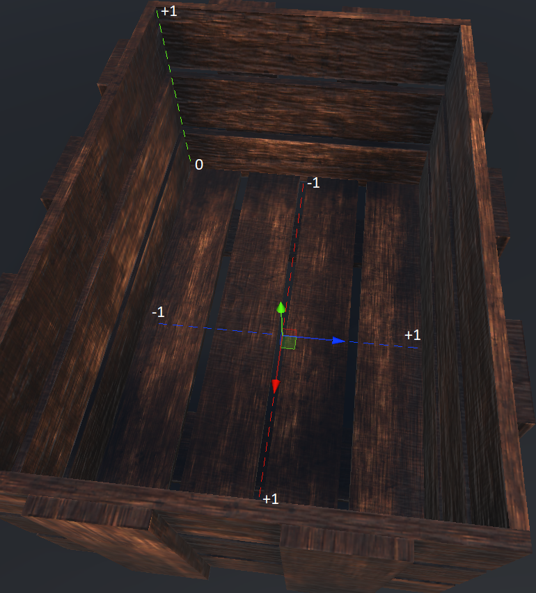

# Dataset description
Since the data includes 6 DoF poses of the gripper and objects, it's necessary to first establish the relevant world and local reference frames. The world reference frame is oriented according to Unity’s standards: the Y axis points up and the X and Z axis are an orthogonal basis of the ground plane, as illustrated here

The gripper reference frame is shown in this figure:

Furthermore, each object has it’s own local reference frame which is defined by its mesh file and the placement box also has a reference frame with normalized coordinates, as illustrated in this figure:

All data is saved with the JSON format (apart from images), to enable cross-platform and cross-language compatibility. 

Each participant is attributed a unique integer identifier and performs the packing task for multiple scenes, each containing a different random subset of objects. For each scene, the following data is recorded and structured in each file as: 
- **PickPlace dataset.json** contains the sequence in which the objects were picked up from the table and placed inside the box, as well as the corresponding grasp poses. It has the following fields:
   * Object identifier: the object’s name, number and a unique ID (since there can be repeated objects on the table). Eg: 003 cracker box-01234.json .
   * Pick translation: a 3-dimensional vector with the translation from the object’s reference frame to the gripper reference frame, upon grasping the object.
   * Pick rotation: a 3x3 rotation matrix that represents the orientation of the gripper w.r.t. the object’s reference frame, upon grasping the object.
   * Place translation: a 3-dimensional vector with the coordinates of where the object was placed inside the box, normalized to [−1, 1] for the width and length dimensions and [0, 1] for the height dimension, as shown in the previous figure.
   * Place rotation: a 3x3 rotation matrix that represents the orientation in which the object was placed inside the box, w.r.t. the world reference frame.

- **object identifier trajectory.json** contains the trajectory of the corresponding object. The trajectories are sampled at 20 Hz for computational efficiency and because practical tests showed that to be a sufficient sampling frequency. Each file is structured as:
   * Object translation: a 3-dimensional vector with the translation from the world reference frame to the object’s reference frame.
   * Object rotation: a 3x3 rotation matrix that represents the orientation of the object w.r.t. the world reference frame.
 
- **top-down.png** is a top-down view of the initial layout of the objects on the table, captured from a secondary camera.
